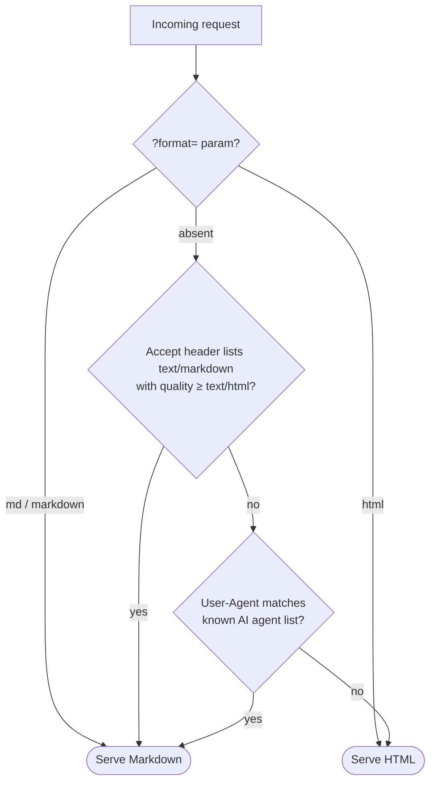

# flask-render-markdown

[](https://github.com/kaushikgandhi/flask-render-markdown/actions/workflows/ci.yml)
[](https://pypi.org/project/flask-render-markdown/)
[](https://pypi.org/project/flask-render-markdown/)
[](LICENSE)

**Flask's `render_template`, but for Markdown.** Serve Markdown to AI agents and HTML to browsers — from the same view, with the same Jinja templates you already know.

```python
from flask import Flask
from flask_render_markdown import render_adaptive

app = Flask(__name__)

@app.get("/docs")
def docs():
    # AI agents get docs.md as text/markdown; browsers get docs.html.
    # (Omit html_template= and browsers get docs.md auto-converted to HTML.)
    return render_adaptive("docs.md", html_template="docs.html", title="API Docs")
```

```bash
curl -A "ClaudeBot/1.0" https://example.com/docs   # -> text/markdown
curl -A "Mozilla/5.0 …" https://example.com/docs   # -> text/html
```

---

**Contents**

- [Why serve Markdown to AI agents?](#why-serve-markdown-to-ai-agents)
- [Installation](#installation)
- [Quickstart](#quickstart)
- [Writing Markdown templates](#writing-markdown-templates)
- [How detection works](#how-detection-works)
- [API reference](#api-reference)
- [Configuration](#configuration)
- [Recipes](#recipes)
- [Testing your app](#testing-your-app)
- [Security notes](#security-notes)
- [FAQ](#faq)
- [Development](#development)
- [Used in production](#used-in-production)

---

## Why serve Markdown to AI agents?

More and more of your traffic isn't a person with a browser — it's an AI assistant fetching a page on a user's behalf (ChatGPT, Claude, Perplexity), or a crawler feeding a model. For those clients, HTML is a bad fit:

- **Tokens.** A typical HTML page is dominated by markup, scripts, and styling. The same content as Markdown is often 5–10× smaller in tokens, which means cheaper calls, faster answers, and more of your actual content fitting in the model's context window.
- **Fidelity.** LLMs are trained on enormous amounts of Markdown. Headings, lists, tables, and code blocks survive as structure instead of being reverse-engineered from a DOM.
- **You control the story.** Instead of hoping an agent's HTML-to-text scraper does your page justice, you decide exactly what the Markdown representation says — the same idea that drives the [`llms.txt` convention](https://llmstxt.org/).

`flask-render-markdown` makes this a one-line change per route. It is deliberately small: no new template language, no middleware magic, no lock-in — just Flask responses built from Jinja templates.

## Installation

```bash
pip install flask-render-markdown
```

If you want browsers to receive your Markdown *converted to HTML* (used by `render_adaptive` when you don't maintain a separate HTML template), add the `html` extra, which pulls in [python-markdown](https://python-markdown.github.io/):

```bash
pip install "flask-render-markdown[html]"
```

Requires **Python ≥ 3.9** and **Flask ≥ 2.0**. The PyPI package is `flask-render-markdown`; the import name is `flask_render_markdown`.

## Quickstart

Project layout — Markdown templates live in your normal `templates/` folder:

```
myapp/
├── app.py
└── templates/
    ├── docs.md
    └── docs.html      (optional)
```

`app.py`:

```python
from flask import Flask
from flask_render_markdown import render_adaptive, render_markdown

app = Flask(__name__)

@app.get("/docs")
def docs():
    # One .md source for everyone: agents get it raw, browsers get it
    # converted to HTML (requires the [html] extra).
    return render_adaptive("docs.md", title="Coffee API")

@app.get("/llms.txt")
def llms():
    # Always Markdown, no negotiation.
    return render_markdown("docs.md", title="Coffee API")
```

`templates/docs.md` — an ordinary Jinja template that happens to be Markdown:

```markdown
# {{ title }}

All endpoints return JSON.

| Method | Path        | Description       |
| ------ | ----------- | ----------------- |
| GET    | /brews      | List all brews.   |
| POST   | /brews      | Start a new brew. |
```

Now compare what different clients receive:

```bash
curl -A "ClaudeBot/1.0" http://127.0.0.1:5000/docs        # Markdown (AI agent UA)
curl -H "Accept: text/markdown" http://127.0.0.1:5000/docs # Markdown (explicit Accept)
curl "http://127.0.0.1:5000/docs?format=md"                # Markdown (manual override)
curl http://127.0.0.1:5000/docs                            # HTML (everyone else)
```

A complete runnable example, including a route that maintains separate `.md` and `.html` templates, is in [`examples/quickstart/`](examples/quickstart/).

## Writing Markdown templates

Markdown templates are **regular Jinja templates**. Everything you use with `render_template` works unchanged, because rendering goes through your app's normal Jinja environment:

- `{{ variables }}`, filters, and tests
- ``, ``, and macros
- `` / `` inheritance
- context processors, `g`, `request`, `session`, `url_for`, `config`

Inheritance example:

```markdown
{# templates/base.md #}
# {{ title }}



---
*{{ config.SITE_NAME }} — generated {{ now.date() }}*
```

```markdown
{# templates/guide.md #}


Follow these steps: {{ steps | join(", ") }}.

```

**No autoescaping.** Flask only autoescapes `.html`/`.htm`/`.xml`/`.xhtml`/`.svg` templates, so values interpolated into `.md` templates are inserted verbatim — `&`, `<`, and `>` stay intact, which is what Markdown needs. (`render_markdown_string` explicitly disables autoescaping for the same reason, since Flask would otherwise escape nameless string templates.) See [Security notes](#security-notes) for what this means when context contains untrusted input.

## How detection works

`render_adaptive` and `wants_markdown()` decide per request, checking three signals in order — the first match wins:



1. **Explicit override — query parameter.** `?format=md` or `?format=markdown` forces Markdown; `?format=html` forces HTML. Useful for debugging and for agents that can't set headers. The parameter name comes from `MARKDOWN_FORMAT_PARAM` (set it to `None` to disable the override entirely).

2. **Accept header.** The client must *explicitly* list `text/markdown` (or `text/x-markdown`) at a quality at least as high as `text/html`. Wildcards do **not** count: `Accept: */*` (curl's default, and part of every browser's Accept header) never triggers Markdown, so ordinary clients are unaffected. Examples:

   | Accept header | Result |
   | --- | --- |
   | `text/markdown` | Markdown |
   | `text/markdown, text/html` | Markdown (equal quality — markdown wins ties) |
   | `text/html, text/markdown;q=0.5` | HTML (markdown listed but lower quality) |
   | `text/html,application/xhtml+xml,*/*;q=0.8` (browser) | HTML |
   | `*/*` (plain curl) | HTML |

3. **User-Agent sniffing.** Many agents fetch with generic Accept headers, so as a fallback the User-Agent is matched (case-insensitive substring) against a curated list of AI agents and AI crawlers. The built-in list, `DEFAULT_AI_USER_AGENTS`, currently covers:

   | Operator | User-Agent tokens |
   | --- | --- |
   | OpenAI | `GPTBot`, `ChatGPT-User`, `OAI-SearchBot` |
   | Anthropic | `ClaudeBot`, `Claude-User`, `Claude-SearchBot`, `claude-web`, `anthropic-ai` |
   | Perplexity | `PerplexityBot`, `Perplexity-User` |
   | Google (AI) | `Google-Extended`, `Google-CloudVertexBot` |
   | Meta | `meta-externalagent`, `meta-externalfetcher` |
   | Others | `Amazonbot`, `Applebot-Extended`, `Bytespider`, `CCBot`, `cohere-ai`, `cohere-training-data-crawler`, `DuckAssistBot`, `MistralAI-User`, `YouBot` |

   Regular search crawlers (Googlebot, Bingbot) are deliberately **not** on the list — they should keep seeing the same HTML as your human visitors. Add your own patterns with `MARKDOWN_EXTRA_AI_USER_AGENTS`, replace the list with `MARKDOWN_AI_USER_AGENTS`, or turn sniffing off with `MARKDOWN_DETECT_AI_AGENTS = False` (the Accept header and `?format=` still work).

Everything else — no override, no explicit Accept, unrecognized User-Agent — gets HTML. Defaulting to HTML is the safe choice: a false "this is an agent" positive would show raw Markdown to a person, while a false negative merely serves an agent your regular HTML, which it can still read.

## API reference

All of these are importable from `flask_render_markdown`.

### `render_markdown(template_name_or_list, **context) -> Response`

The drop-in for `flask.render_template`. Renders the template through your app's Jinja environment and returns a `Response` with the `MARKDOWN_MIMETYPE` mimetype (default `text/markdown; charset=utf-8`). No negotiation — the response is always Markdown.

```python
@app.get("/guide")
def guide():
    return render_markdown("guide.md", user=current_user)
```

Like `render_template`, it accepts a list of template names and uses the first one that exists, and raises `jinja2.TemplateNotFound` (→ HTTP 500) if none do:

```python
return render_markdown([f"docs/{page}.md", "docs/404.md"], page=page)
```

### `render_adaptive(template_name_or_list, *, html_template=None, **context) -> Response`

One view, two representations. If [the client wants Markdown](#how-detection-works), behaves exactly like `render_markdown`. Otherwise the client gets HTML, produced one of two ways:

- **`html_template` given** — that template is rendered with the same context. Use this when you maintain hand-crafted HTML and Markdown versions side by side:

  ```python
  return render_adaptive("docs.md", html_template="docs.html", page=page)
  ```

- **`html_template` omitted** — the rendered Markdown is converted to HTML (needs the `[html]` extra) and wrapped in a page. The wrapper is `MARKDOWN_HTML_TEMPLATE` if configured, else a minimal built-in page whose `<title>` comes from `context["title"]`, falling back to the document's first `# heading`, falling back to `"Document"`.

  ```python
  return render_adaptive("docs.md", page=page)   # one .md file serves everyone
  ```

`html_template` is keyword-only, so it can never collide with a positional argument; consequently `html_template` is also the one context-variable name you can't pass through.

Unless disabled via `MARKDOWN_VARY_HEADER`, every `render_adaptive` response carries `Vary: Accept` (plus `User-Agent` while agent sniffing is on) so HTTP caches store the representations separately.

### `render_markdown_string(source, **context) -> Response`

Renders Markdown from a template *string*, like `flask.render_template_string`, and returns a Markdown response. Autoescaping is explicitly disabled — Flask autoescapes nameless templates, which would corrupt Markdown by turning `&` into `&amp;`.

```python
return render_markdown_string("# Hello {{ name }}", name=user.name)
```

### `markdown_response(markdown_text, status=None, headers=None) -> Response`

Wraps *already rendered* Markdown text in a response with the configured mimetype. Use it when the Markdown is produced by something other than a template — a database field, a generator, a file on disk:

```python
@app.get("/reports/<int:report_id>")
def report(report_id):
    return markdown_response(build_report_markdown(report_id))
```

### `wants_markdown() -> bool`

The negotiation logic by itself (see [How detection works](#how-detection-works)). Needs a request context. Build your own flows with it:

```python
@app.get("/search")
def search():
    results = run_search(request.args["q"])
    if wants_markdown():
        return markdown_response(results_to_markdown(results))
    return render_template("results.html", results=results)
```

### `is_ai_agent(user_agent=None) -> bool`

True if the given User-Agent string (or the current request's, when omitted) matches the configured AI agent patterns. Needs an app context for configuration; useful on its own for logging or analytics:

```python
@app.before_request
def tag_agent_traffic():
    g.is_agent = is_ai_agent()
```

### `markdown_to_html(markdown_text) -> str`

Converts Markdown source to an HTML *fragment* using python-markdown with the `MARKDOWN_EXTENSIONS` extensions (default `("extra",)` — tables, fenced code, footnotes, and more). Raises a `RuntimeError` with install instructions if the `Markdown` package is missing.

### `class RenderMarkdown(app=None, **options)`

Optional extension that registers configuration on the app — the rendering functions work without it. Options (each maps to the `MARKDOWN_*` config key of the same meaning): `mimetype`, `format_param`, `detect_ai_agents`, `ai_user_agents`, `extra_ai_user_agents`, `html_template`, `markdown_extensions`, `vary_header`. Unknown options raise `TypeError`.

```python
from flask_render_markdown import RenderMarkdown

md = RenderMarkdown(
    app,
    extra_ai_user_agents=("MyCompanyAgent",),
    html_template="markdown_page.html",
)
```

Works with the application-factory pattern:

```python
md = RenderMarkdown(detect_ai_agents=False)

def create_app():
    app = Flask(__name__)
    md.init_app(app)
    return app
```

### Module constants

- `DEFAULT_AI_USER_AGENTS` — the built-in tuple of User-Agent substrings.
- `DEFAULTS` — dict of every config key and its default value.
- `__version__`.

## Configuration

Every setting is a plain `app.config` key, read at request time — the extension is just a convenient way to set them. Precedence, from strongest to weakest: **values already in `app.config`** (e.g. from `from_prefixed_env()` or a config file) → **`RenderMarkdown(...)` keyword options** → **packaged defaults**. That order means deployment configuration can always override what's written in code.

| Config key | Default | Meaning |
| --- | --- | --- |
| `MARKDOWN_MIMETYPE` | `"text/markdown"` | Mimetype of Markdown responses. `text/markdown` is the [registered type (RFC 7763)](https://www.rfc-editor.org/rfc/rfc7763); switch to `"text/plain"` if a client renders the response as a download or you want it readable in any browser. |
| `MARKDOWN_FORMAT_PARAM` | `"format"` | Query parameter for manual overrides (`?format=md` / `?format=html`). `None` or `""` disables the override. |
| `MARKDOWN_DETECT_AI_AGENTS` | `True` | Enable User-Agent sniffing. When off, only the Accept header and the format parameter trigger Markdown. |
| `MARKDOWN_AI_USER_AGENTS` | `None` | *Replace* the built-in agent list with your own iterable of substrings. `None` means "use `DEFAULT_AI_USER_AGENTS`". |
| `MARKDOWN_EXTRA_AI_USER_AGENTS` | `()` | *Extend* the agent list without replacing it. |
| `MARKDOWN_HTML_TEMPLATE` | `None` | Template that wraps Markdown converted to HTML. It receives the converted HTML as `content` (already Markup-safe, so `{{ content }}` won't be escaped) plus the view's original context. `None` uses the built-in minimal page. |
| `MARKDOWN_EXTENSIONS` | `("extra",)` | [python-markdown extensions](https://python-markdown.github.io/extensions/) used by `markdown_to_html`, e.g. `("extra", "toc", "sane_lists")`. |
| `MARKDOWN_VARY_HEADER` | `True` | Add `Vary: Accept[, User-Agent]` to `render_adaptive` responses so shared caches don't mix representations. Only disable this if you handle `Vary` yourself. |

Without the extension:

```python
app.config["MARKDOWN_MIMETYPE"] = "text/plain"
app.config["MARKDOWN_EXTRA_AI_USER_AGENTS"] = ("InternalCrawler",)
```

## Recipes

### An `llms.txt` route

The [`llms.txt` convention](https://llmstxt.org/) gives agents a well-known Markdown entry point to your site:

```python
@app.get("/llms.txt")
def llms():
    return render_markdown("llms.md", sections=SECTIONS)
```

### A whole Markdown docs section from files

```python
from jinja2 import TemplateNotFound
from flask import abort

@app.get("/docs/<path:page>")
def doc_page(page):
    try:
        return render_adaptive(f"docs/{page}.md")
    except TemplateNotFound:
        abort(404)
```

### Styling the browser version with your site layout

Point `MARKDOWN_HTML_TEMPLATE` at a template that extends your base layout; converted Markdown arrives as `content`:

```html
{# templates/markdown_page.html #}


  <article class="prose">{{ content }}</article>

```

```python
RenderMarkdown(app, html_template="markdown_page.html")
```

### Markdown built at runtime (no template file)

```python
@app.get("/status.md")
def status():
    lines = ["# Service status", ""]
    lines += [f"- **{s.name}**: {s.state}" for s in check_services()]
    return markdown_response("\n".join(lines))
```

### Behind a CDN

Nothing to do beyond the defaults: `render_adaptive` sends `Vary: Accept, User-Agent`, so compliant caches key the two representations separately. Note that varying on `User-Agent` fragments the cache heavily; if that matters, disable sniffing (`MARKDOWN_DETECT_AI_AGENTS = False`) and rely on Accept headers and `?format=md` (different URL → different cache entry) instead.

### Logging which routes agents actually hit

```python
@app.after_request
def log_agent_hits(response):
    if is_ai_agent():
        app.logger.info("agent hit: %s %s", request.user_agent, request.path)
    return response
```

## Testing your app

Simulate the different clients with Flask's test client:

```python
def test_docs_markdown_for_agents(client):
    response = client.get("/docs", headers={"User-Agent": "ClaudeBot/1.0"})
    assert response.mimetype == "text/markdown"
    assert response.text.startswith("# ")

def test_docs_html_for_browsers(client):
    browser_accept = "text/html,application/xhtml+xml,application/xml;q=0.9,*/*;q=0.8"
    response = client.get("/docs", headers={"Accept": browser_accept})
    assert response.mimetype == "text/html"

def test_manual_override(client):
    assert client.get("/docs?format=md").mimetype == "text/markdown"
```

## Security notes

- **Untrusted input in templates.** `.md` templates are rendered *without* autoescaping (correct for Markdown), and Markdown may itself contain raw HTML which python-markdown passes through untouched. The Markdown representation is plain text to the client, but the **converted HTML** served to browsers is not — if your template context includes user-supplied strings, sanitize the conversion output (e.g. with [`nh3`](https://nh3.readthedocs.io/) or `bleach`) or stick to `html_template` with normal autoescaped HTML for the browser path.
- **Detection is advisory, not authentication.** User-Agent strings and Accept headers are trivially spoofed. Serving Markdown to anyone who asks is harmless by design — but never use `is_ai_agent()`/`wants_markdown()` for access control, rate limiting, or anything security-relevant.
- **Same content, different clothes.** Serve agents the same substantive content as humans, formatted differently. Feeding crawlers different *information* than visitors (cloaking) can get a site penalized by search engines.

## FAQ

**How is this different from Flask-Markdown or a `markdown` Jinja filter?**
Those render Markdown *into your HTML pages* for humans. `flask-render-markdown` goes the other direction: it serves the Markdown itself as the HTTP response for clients that prefer it, with HTML as the fallback for people.

**Does this hurt SEO?**
No. Googlebot/Bingbot aren't in the agent list, so search crawlers see your normal HTML, and the `Vary` header tells caches not to mix things up. Only AI-specific fetchers get Markdown.

**Why default to `text/markdown` and not `text/plain`?**
`text/markdown` is the registered mimetype for Markdown (RFC 7763) and tells capable clients exactly what they're getting. Browsers hitting a Markdown URL directly may offer to download it, though — if your Markdown routes are also meant for humans-with-browsers, either use `render_adaptive` (browsers then get HTML) or set `MARKDOWN_MIMETYPE = "text/plain"`.

**A plain `curl` gets HTML — isn't curl "not a browser"?**
curl sends `Accept: */*`, which is a preference for *anything*, not a request for Markdown. Guessing Markdown from wildcards would change behavior for every HTTP client in existence. `curl -H "Accept: text/markdown"` or `?format=md` gets you Markdown explicitly.

**Do I need the `Markdown` package?**
Only for automatic Markdown→HTML conversion (`render_adaptive` without `html_template`, or calling `markdown_to_html`). Pure-Markdown deployments — agent endpoints, `llms.txt`, APIs — need no extra dependency.

**Can I use it in blueprints?**
Yes. The functions behave exactly like `render_template`, including blueprint template folders and the normal template search order.

**What about async views?**
Fine too — the functions are synchronous and cheap, and Flask runs them inside your async view just as it does `render_template`.

## Development

```bash
git clone https://github.com/kaushikgandhi/flask-render-markdown.git
cd flask-render-markdown
python -m venv .venv && source .venv/bin/activate
pip install -e ".[dev]"
pytest
```

The test suite covers rendering, negotiation, adaptive responses, and the extension. Try the demo app with `python examples/quickstart/app.py`.

## Used in production

`flask-render-markdown` powers the Markdown responses behind millions of AI-agent requests at [prisonassist.com](https://prisonassist.com).

Using it in your project? Open an issue or PR to get listed here.

## License

[MIT](LICENSE)
