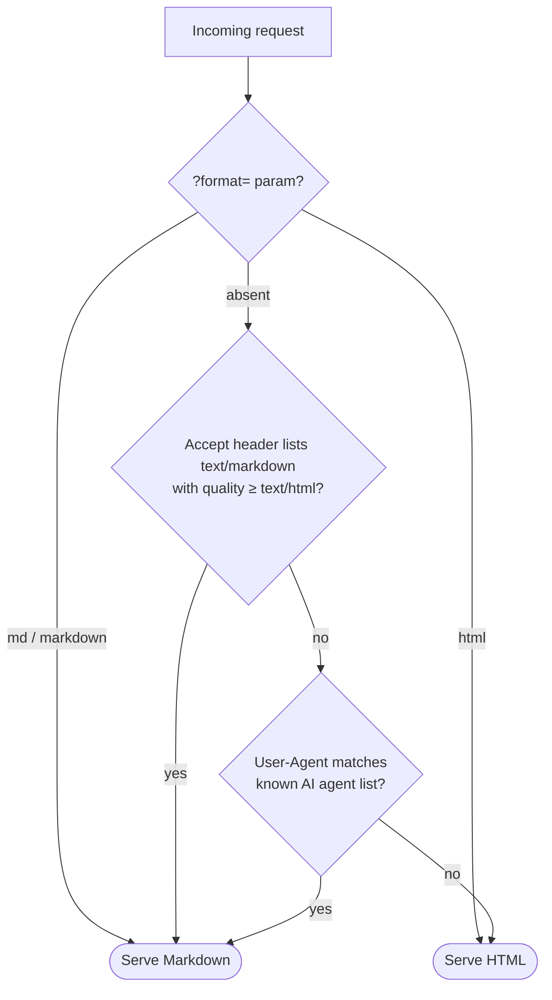

# How detection works

`render_adaptive` and `wants_markdown()` decide per request, checking three signals in order — the first match wins:

## 1. Explicit override — query parameter

`?format=md` or `?format=markdown` forces Markdown; `?format=html` forces HTML. Useful for debugging and for agents that can't set headers. The parameter name comes from `MARKDOWN_FORMAT_PARAM` (set it to `None` to disable the override entirely).

## 2. Accept header

The client must *explicitly* list `text/markdown` (or `text/x-markdown`) at a quality at least as high as `text/html`. Wildcards do **not** count: `Accept: */*` (curl's default, and part of every browser's Accept header) never triggers Markdown, so ordinary clients are unaffected.

| Accept header | Result |
| --- | --- |
| `text/markdown` | Markdown |
| `text/markdown, text/html` | Markdown (equal quality — markdown wins ties) |
| `text/html, text/markdown;q=0.5` | HTML (markdown listed but lower quality) |
| `text/html,application/xhtml+xml,*/*;q=0.8` (browser) | HTML |
| `*/*` (plain curl) | HTML |

## 3. User-Agent sniffing

Many agents fetch with generic Accept headers, so as a fallback the User-Agent is matched (case-insensitive substring) against a curated list of AI agents and AI crawlers. The built-in list, `DEFAULT_AI_USER_AGENTS`, currently covers:

| Operator | User-Agent tokens |
| --- | --- |
| OpenAI | `GPTBot`, `ChatGPT-User`, `OAI-SearchBot` |
| Anthropic | `ClaudeBot`, `Claude-User`, `Claude-SearchBot`, `claude-web`, `anthropic-ai` |
| Perplexity | `PerplexityBot`, `Perplexity-User` |
| Google (AI) | `Google-Extended`, `Google-CloudVertexBot` |
| Meta | `meta-externalagent`, `meta-externalfetcher` |
| Others | `Amazonbot`, `Applebot-Extended`, `Bytespider`, `CCBot`, `cohere-ai`, `cohere-training-data-crawler`, `DuckAssistBot`, `MistralAI-User`, `YouBot` |

Regular search crawlers (Googlebot, Bingbot) are deliberately **not** on the list — they should keep seeing the same HTML as your human visitors. Add your own patterns with `MARKDOWN_EXTRA_AI_USER_AGENTS`, replace the list with `MARKDOWN_AI_USER_AGENTS`, or turn sniffing off with `MARKDOWN_DETECT_AI_AGENTS = False` (the Accept header and `?format=` still work).

## The default is HTML

Everything else — no override, no explicit Accept, unrecognized User-Agent — gets HTML. Defaulting to HTML is the safe choice: a false "this is an agent" positive would show raw Markdown to a person, while a false negative merely serves an agent your regular HTML, which it can still read.
